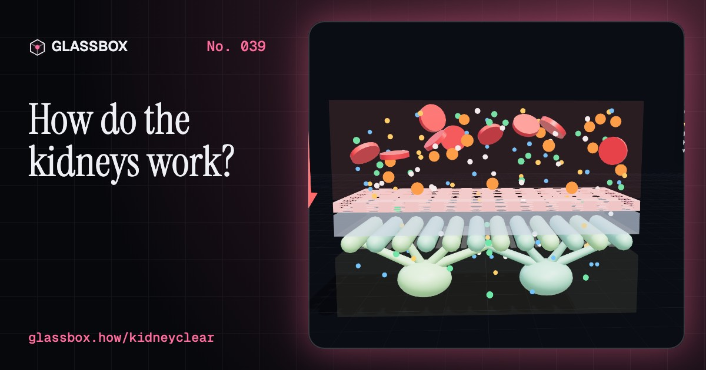
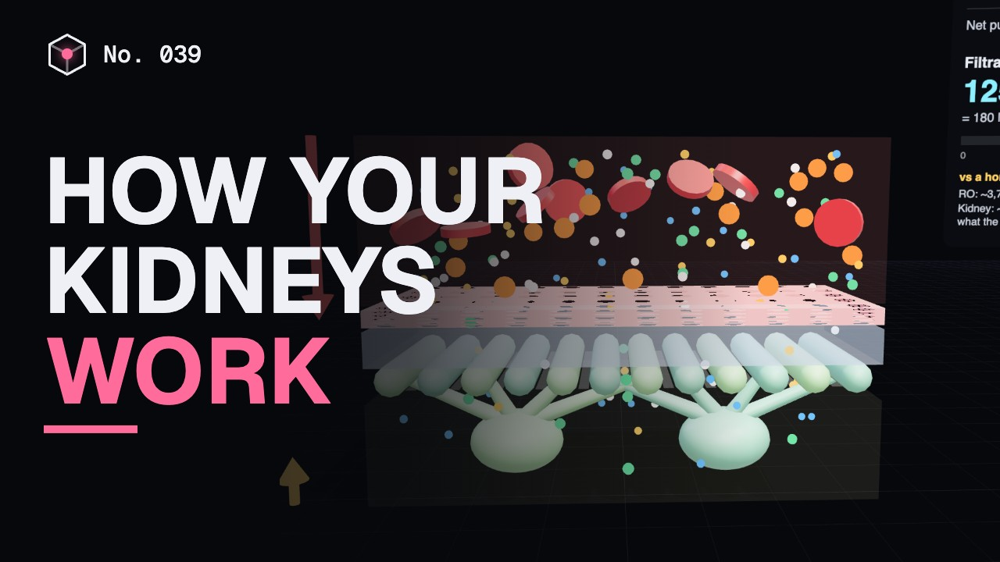
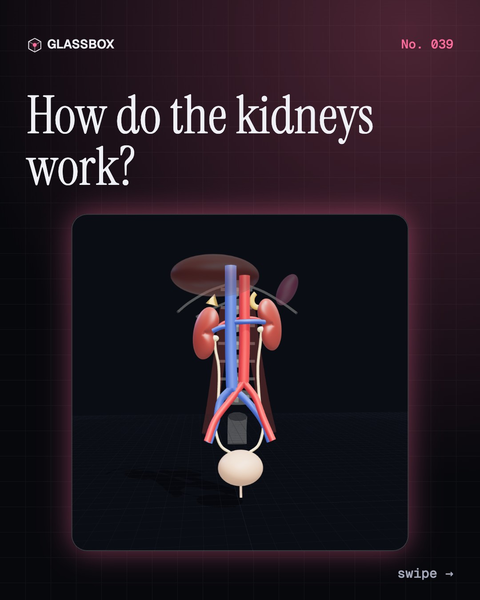
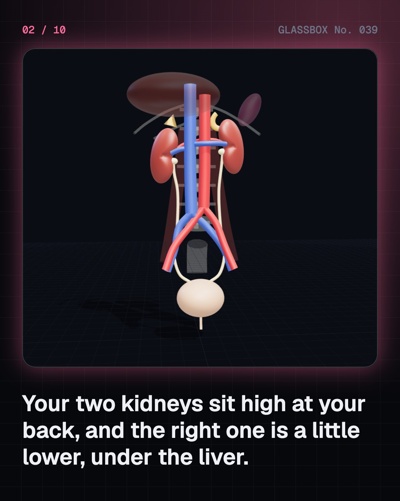
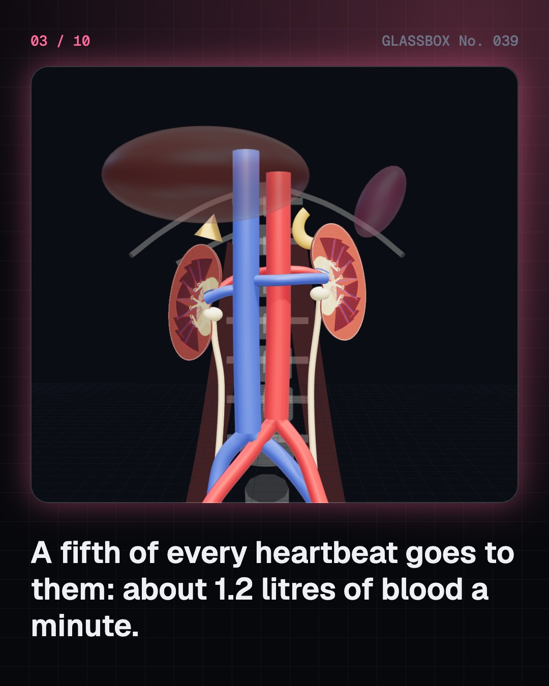
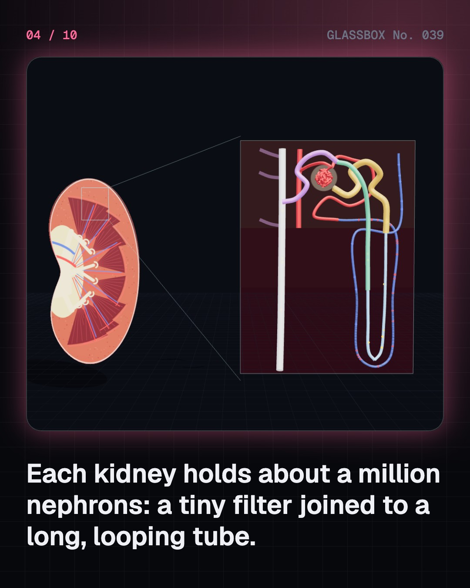

<!-- glassbox:start -->
<!-- Generated from glassbox.json by the Glassbox hub (npm run readme -- kidneyclear). Edit glassbox.json, not this block. -->
<p align="center"><a href="https://glassbox.how/e/kidneyclear/"></a></p>

<h1 align="center">KidneyClear</h1>

<p align="center"><b>How do the kidneys work?</b><br>Every day your kidneys squeeze about 180 litres out of your blood and quietly put 99% of it back. Zoom into a nephron, push plasma through a three-layer filter, watch ADH turn urine dark, and see how dialysis and transplants took over when kidneys fail.</p>

<p align="center"><a href="https://glassbox.how/kidneyclear/"><b>▶ Play with it</b></a> &nbsp;·&nbsp; <a href="https://glassbox.how/e/kidneyclear/">Read the 60-second explainer</a> &nbsp;·&nbsp; <a href="https://glassbox.how/kidneyclear/glassbox/reel.mp4">Watch the 40-second video</a></p>

<p align="center">
  <a href="https://glassbox.how/e/kidneyclear/"></a>
  <a href="https://glassbox.how/e/kidneyclear/"></a>
  <a href="LICENSE"></a>
  <a href="LICENSE-CONTENT.md"></a>
  <a href="#privacy"></a>
</p>

## In 60 seconds

1. **Two beans at your back.** Two fist-sized kidneys, about 150 g each, sit against the back wall of the abdomen, the right a little lower under the liver. They get about 1.1 to 1.2 litres of blood a minute, a fifth to a quarter of the heart's output. Urine runs down the ureters into the bladder.
2. **A million tiny filters.** Each kidney has about a million nephrons (from about 200,000 to over 2.5 million). Each is a glomerulus, a knot of capillaries in Bowman's capsule, joined to a long tubule wrapped in capillaries.
3. **Filtering by blood pressure.** About 55 mmHg of blood pressure, minus 15 from the capsule and 30 from blood proteins, leaves a net push of about 10 mmHg. Through a three-layer filter that is enough for about 125 mL a minute, 180 litres a day. Water, salt, glucose and urea pass; cells and big proteins stay.
4. **Taking 99% back.** The proximal tubule reclaims about two thirds of the salt and water and all the glucose. The loop of Henle makes the medulla salty, and ADH decides how much water the collecting ducts pull back by osmosis: from about 50 to 1,200 mOsm/kg, pale to dark.
5. **More than a filter.** The kidneys steer blood pressure with renin, angiotensin II and aldosterone, answer ADH to save water, keep potassium and acid in range, activate vitamin D, and send EPO to make red blood cells when oxygen is low.
6. **When kidneys fail.** Stones form when urine is too concentrated. Chronic kidney disease, mostly from diabetes and high blood pressure, affects about 788 million adults, about 138 million in India, often without symptoms. Dialysis and transplants can take over. For your own health, talk to a doctor.

## Words worth knowing

| Term | Meaning |
|---|---|
| **Nephron** | The kidney's working unit: a glomerulus and a long tubule. About a million per kidney. |
| **Glomerulus** | A knot of capillaries where blood pressure filters plasma into Bowman's capsule. |
| **GFR** | Glomerular filtration rate: about 125 mL a minute, or 180 litres a day, in a young adult. |
| **Reabsorption** | Taking water and useful substances back from the tubule into the blood; about 99% of the water. |
| **Loop of Henle** | The hairpin part of the tubule that makes the medulla salty so urine can be concentrated. |
| **ADH (vasopressin)** | A pituitary hormone that makes the collecting ducts take back more water. |
| **Renin** | A kidney enzyme released when blood pressure falls; it starts the chain to angiotensin II and aldosterone. |
| **Erythropoietin (EPO)** | A kidney hormone that tells bone marrow to make red blood cells. |
| **Dialysis** | Cleaning the blood with a machine filter or the belly's own lining when the kidneys fail. |

## A short history

**From reading urine in a flask and cutting out stones to a machine that cleans blood and a kidney that can be given away.**

- **300 BCE** · Cutting out bladder stones (Sushruta and the Sushruta Samhita, Ancient India (traditionally Varanasi))
- **170** · Galen proves the kidneys make urine (Galen of Pergamon, Pergamon and Rome)
- **1666** · Tiny knots in the kidney (Marcello Malpighi, Bologna)
- **1827** · Bright's disease (Richard Bright, Guy's Hospital, London)
- **1842** · Bowman's capsule (William Bowman, King's College, London)
- **1844** · Blood pressure does the filtering (Carl Ludwig, Marburg)
- **1862** · The loop of Henle (Jakob Henle, Göttingen)
- **1945** · Kolff's rotating drum kidney (Willem Kolff, Kampen)

The full story, with 30 moments, charts, people and 41 sources: [glassbox.how/e/kidneyclear/history](https://glassbox.how/e/kidneyclear/history/). The data lives in [`history.json`](history.json).

## Video and slides

Made with the Glassbox studio from this box's storyboard (`window.glassbox.director`). Free to reuse under CC BY 4.0.

<a href="https://glassbox.how/kidneyclear/glassbox/video.mp4"></a>

<p><a href="glassbox/slide-1.jpg"></a> <a href="glassbox/slide-2.jpg"></a> <a href="glassbox/slide-3.jpg"></a> <a href="glassbox/slide-4.jpg"></a></p>

| File | What | Size |
|---|---|---|
| [`glassbox/reel.mp4`](https://glassbox.how/kidneyclear/glassbox/reel.mp4) | Reel / Short, with captions and soundtrack | 1080×1920 |
| [`glassbox/video.mp4`](https://glassbox.how/kidneyclear/glassbox/video.mp4) | YouTube video, with captions and soundtrack | 1920×1080 |
| `glassbox/slide-1…10.jpg` | Instagram carousel | 1080×1350 |
| `glassbox/thumb.jpg` | YouTube thumbnail | 1280×720 |
| `glassbox/cover.jpg` | Share card and repo social preview | 1200×630 |
| [`glassbox/history-reel.mp4`](https://glassbox.how/kidneyclear/glassbox/history-reel.mp4) | “History in 10 moments” Reel / Short | 1080×1920 |
| `glassbox/history-slide-*.jpg` | History carousel | 1080×1350 |
| `glassbox/post.json` | Post copy and schedule used by the publish kit | |

## Privacy

This box has no accounts and no ads, and it ships its own fonts and libraries. When you run it yourself it sends nothing anywhere. On glassbox.how, the site's `/bar.js` also loads Glassbox's analytics: **Google Analytics** to count visits (it asks first in the EU, UK and Switzerland, and stays off when your browser sends Global Privacy Control or Do Not Track) and **ClickTrust** to detect bots.

It remembers a few things **in your own browser only**, and never sends them anywhere:

| Browser storage key | What it holds |
|---|---|
| `kidneyclear.v1` | Which chapters you have opened, your best quiz scores, and sound on or off. |

Exactly what each one sees is at [glassbox.how/privacy](https://glassbox.how/privacy/).

## Licences

- **Code:** [MIT](LICENSE). Use it, change it, ship it.
- **Explanations, text, images and videos** (`glassbox.json`, `glassbox/`): [CC BY 4.0](LICENSE-CONTENT.md). Credit “Glassbox, glassbox.how/e/kidneyclear”.
- **Third-party parts** keep their own licences: [three.js](https://threejs.org) (MIT), [Geist, Instrument Serif](https://openfontlicense.org) (SIL OFL 1.1).
- The Glassbox name and logo aren't covered by either licence. See the [terms](https://glassbox.how/terms/).

Found a mistake? [Open an issue](https://github.com/bdeeps/kidneyclear/issues). Corrections happen in public.
<!-- glassbox:end -->

## Run it

It's plain HTML, CSS and JavaScript. No build step and no dependencies. Run locally, it contacts no other website.

```bash
python3 -m http.server 8000
```

Three.js and the fonts ship in `vendor/` and `fonts/`, so it also works offline.

Then open http://localhost:8000.

## How it's built

| File | What |
|---|---|
| `index.html`, `css/app.css` | The page and its styles |
| `js/app.js`, `js/stage.js`, `js/ui.js`, `js/kit.js` | The shared Glassbox 3D engine: chapters, 3D stage, controls, quiz, video director |
| `js/chapters/*.js` | One file per chapter: the 3D model, controls, text, key terms, quiz and video scenes |
| `js/kidney.js` | The 3D urinary tract (kidneys, adrenal glands, renal vessels, aorta and vena cava, ureters, bladder, spine and ribs), the kidney's coronal section, a nephron with its blood vessels, and shared helpers |
| `glassbox.json` | Title, question, explainer beats, key terms, browser storage and credits shown on glassbox.how |
| `reel` in each chapter | The storyboard the Glassbox studio records into short videos |
| `glassbox/` | The published video, slides, thumbnail and post copy |
| `fonts/`, `vendor/three/` | Self-hosted Geist and Instrument Serif (SIL OFL 1.1) and three.js (MIT) |
